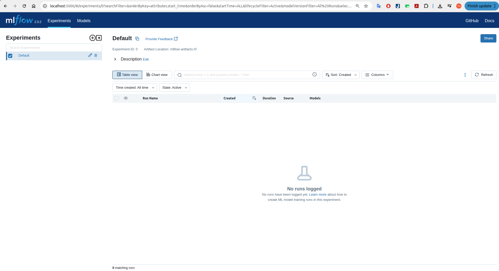
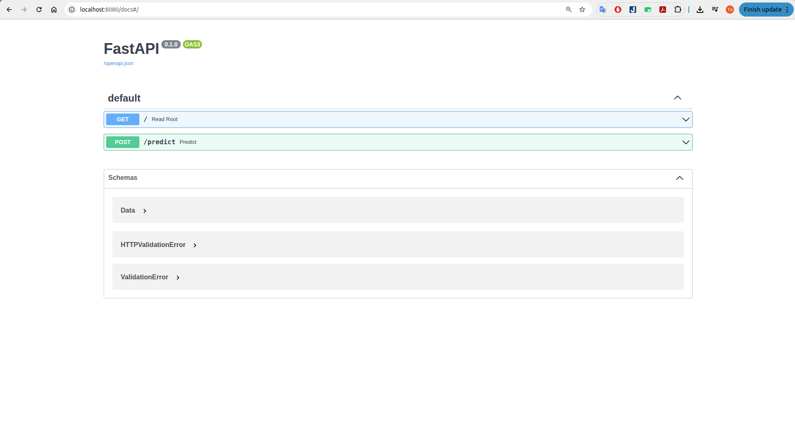
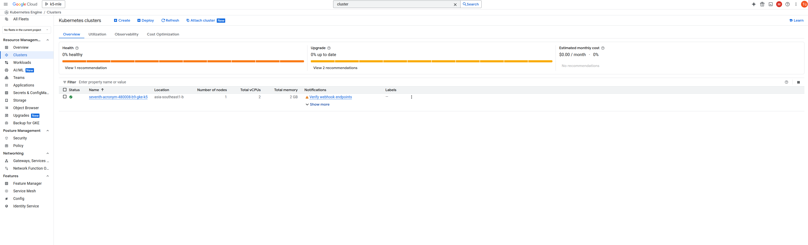
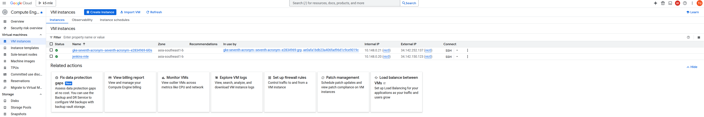
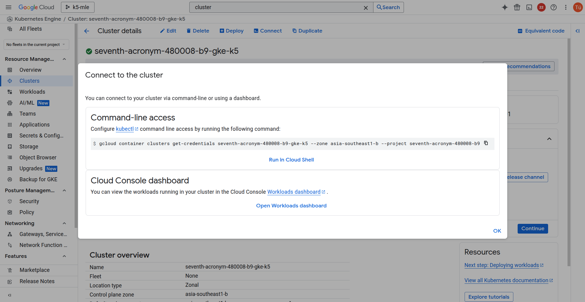
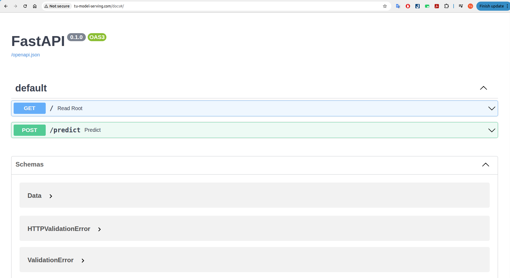
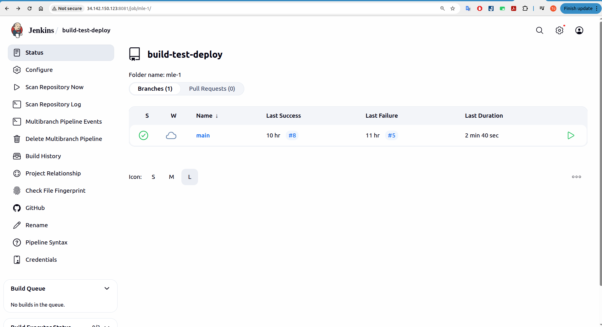
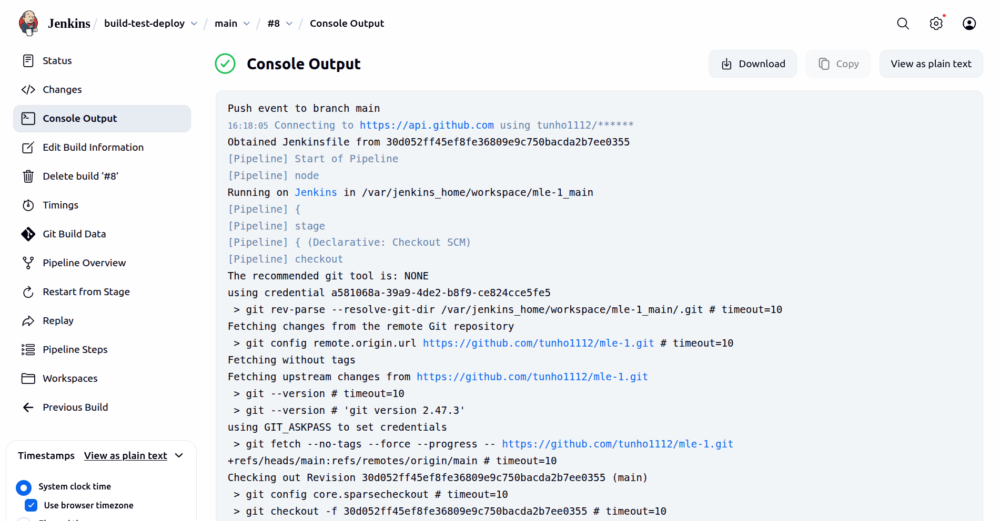

# 🚀 Builde MLOPs for Prediction ML System
This project aims to build a full MLOps pipeline for a machine learning prediction system, focusing on diabetes prediction. It covers the steps from data processing, model training, evaluation, and deployment, to automating workflows with best practices. The goal is to demonstrate a robust, reproducible, and scalable approach to operationalizing ML models in production environments.\


## 📑 Table of Contents
- [📊 Dataset](#-dataset)
- [🌐 Architecture Overview](#-architecture-overview)
  - [1. Develop Model](#1-develop-model)
  - [2. Web API](#2-web-api)
  - [3. Cloud](#3-cloud)
  - [4. CI/CD](#4-cicd)

- [📖 Details](#-details)


## 🛠️ Prerequisite
To get started with this project, please ensure you have the following installed:
- Python 3.9 
- `miniconda`, `docker` installed

Install the required dependencies using the following command:

## 📊 Dataset
> Onset of Diabetes Prediction
Link: [data](https://machinelearningmastery.com/develop-first-xgboost-model-python-scikit-learn/)

This dataset is comprised of 8 input variables that describe medical details of patients and one output variable to indicate whether the patient will have an onset of diabetes within 5 years.
You can learn more about this dataset on the UCI Machine Learning Repository website.

## 1. Develop Model


```bash
conda create -n mle1 python=3.9
conda activate mle1
pip install -r requirements.txtProcessing Data
```
Setting up MLflow Tracking Server with Docker
```bash
docker compose -f deployment/mlflow/docker-compose.yml up -d
```
- The tracking server will be available at: [http://localhost:5000](http://localhost:5000)


### Development model:
Run the following command to process your dataset:
```bash
python src/split_data.py
```
Training model and push model to model registry [http://localhost:5000](http://localhost:5000)

```bash
python src/train.py --model_name xgb # with xgb model
```


### Prediction Model
You can use the trained and registered model for prediction by loading it from the MLflow

Example usage:

```bash
python src/predict.py
```
This will:
- Load the saved model from the MLflow registry (using the default config or the one you provide in the script).
- Run predictions using the validation dataset (`data/val.csv`).
You can specify different model names or versions by editing the script or updating the CLI options inside `src/predict.py`:

## 2. Web API
To run the RESTful API service using FastAPI and Uvicorn in `src/main.py`, use the following command:
```bash
uvicorn src.main:app --host 0.0.0.0 --port 8080
```
The service will be available at [http://localhost:8080](http://localhost:8080).

#### 📖 API Endpoints
- **POST /predict**  
  - Runs inference using the loaded model.
  - Expects a JSON payload containing:
    - `id`: (string or int) input id/reference
    - `data`: list of lists (rows of feature values)
    - `columns`: list of column names (feature names)

  - Example request:
    ```json
    {
      "id": "123",
      "data": [[6,148,72,35,0,33.6,0.627,50]],
      "columns": ["Pregnancies","Glucose","BloodPressure","SkinThickness","Insulin","BMI","DiabetesPedigreeFunction","Age"]
    }
    ```
  - Example using `curl`:
    ```bash
    curl -X POST "http://localhost:8080/predict" \
         -H "Content-Type: application/json" \
         -d '{
              "id": "123",
              "data": [[6,148,72,35,0,33.6,0.627,50]],
              "columns": ["Pregnancies","Glucose","BloodPressure","SkinThickness","Insulin","BMI","DiabetesPedigreeFunction","Age"]
            }'
    ```
  - Example response:
    ```json
    {
      "id": "123",
      "predictions": [1]
    }
    ```

> For more information, check the video guide at:
`video_records/service_docker.mkv`

## 3. Cloud
To deploy this solution on cloud infrastructure wit Google Cloud Platform, you can automate resource provisioning using [Terraform](https://www.terraform.io/). Below is a general guide for creating a compute VM and optionally a Kubernetes cluster.
### Prerequisites
1. **Google account & GCP project**
   - Make sure you have a [Google Cloud Platform (GCP) account](https://console.cloud.google.com/).
   - [Create a new GCP project](https://console.cloud.google.com/cloud-resource-manager) or select an existing one.
   - Note your **Project ID** (you'll need this for configuration).
2. **Set up billing and APIs**
   - Ensure billing is enabled for your project.
   - Enable the following APIs in the [APIs & Services dashboard](https://console.cloud.google.com/apis/library):
     - Compute Engine API
     - Kubernetes Engine API
     - Artifact Registry API (if you plan to store Docker images)
     - Service Account Credentials API
3. **Install & initialize Google Cloud CLI**

   - Install the [Google Cloud SDK](https://cloud.google.com/sdk/docs/install) if not already done.
   - Authenticate and set your project by running:
     ```bash
     gcloud auth login
     gcloud config set project <YOUR_PROJECT_ID>
     ```
### Install Terraform
- Follow the [Terraform installation guide](https://developer.hashicorp.com/terraform/downloads) for your platform.
- Common installation steps for Linux/macOS:
  ```bash
  # Download latest Terraform (update link as needed)
  wget https://releases.hashicorp.com/terraform/1.8.5/terraform_1.8.5_linux_amd64.zip
  unzip terraform_1.8.5_linux_amd64.zip
  sudo mv terraform /usr/local/bin/
  terraform -v
  ```
Once installed, you should be able to run:
```bash
terraform -version
```

### Create Cluster and VM Instance on GCP
Initialize and deploy with Terraform
From the `iac/terraform/` directory, run:
```bash
terraform init
terraform plan
terraform apply
```
Cluster on GCP:

VM on GCP


### Deploy service to cluster GCP
Config kubeconfig to connect to cluster: 

The following commands will deploy the NGINX ingress controller and the machine learning model service to your Kubernetes cluster on GCP:
```bash
# deploy nginx
kubectl create ns nginx-system
kubens nginx-system
cd k8s/helm/nginx-ingress
helm upgrade --install nginx-ingress .
# deploy model 
kubectl create ns model-serving
kubens model-serving
cd k8s/helm/diabetes
helm upgrade --install serving .
```

> For more information, check the video guide at:
`video_records/k8s_cloud.mkv`

### Deploy Jenkins to VM Instance on GCP 
Check the video guide at: `video_records/deploy_jenkins.mkv`    

## 4. CICD
### Jenkins Pipeline: Build, Push, and Deploy (GitLab → DockerHub → Kubernetes)

Below is a guideline to configure a Jenkins pipeline that will:
1. **Clone source code from GitLab**
2. **Build and push the Docker image to DockerHub**
3. **Deploy the application to your Kubernetes cluster**

#### 1. Prerequisites

- Jenkins server running, with Docker, kubectl, and Helm installed.
- Jenkins **GitLab** plugin installed.
- Jenkins credentials set up:
  - **GitLab**: Username/Password or Personal Access Token (as a secret)
  - **DockerHub**: Username/Password (as a DockerHub credential in Jenkins)
  - **Kubeconfig** for cluster deployment (as a secret file credential)
- Jenkins agent/runner has access to Docker daemon.
- Proper context/namespace access for kubectl/helm on the Jenkins host.



#### 2. Example Jenkins Pipeline (`Jenkinsfile`)

This file defines the automation stages for building, testing, packaging, and deploying the ML model service using Jenkins. The typical pipeline in this `Jenkinsfile` includes:
- **Test Stage:** Runs unit tests and validates dependencies by installing requirements and executing tests (usually using `pytest`).
- **Build Stage:** Builds a Docker image of the service and tags it with the Jenkins build number, preparing it for deployment.
- **Push Stage:** Authenticates with DockerHub (using stored Jenkins credentials) and pushes both the versioned and `latest` tags of the Docker image to the DockerHub registry.
- **Deploy Stage:** Uses Kubernetes and Helm inside a containerized environment to deploy or upgrade the service on a target Kubernetes cluster based on the latest image.

It also manages retention of build logs and incorporates timestamps for better build traceability. Credentials for DockerHub and any Kubernetes operations are managed securely via Jenkins credentials and secrets.  
To use the pipeline, create a `Jenkinsfile` in your project’s root directory and commit it to your repository.


For video guidance, see: `video_records/jenkins_cicd.mkv`


