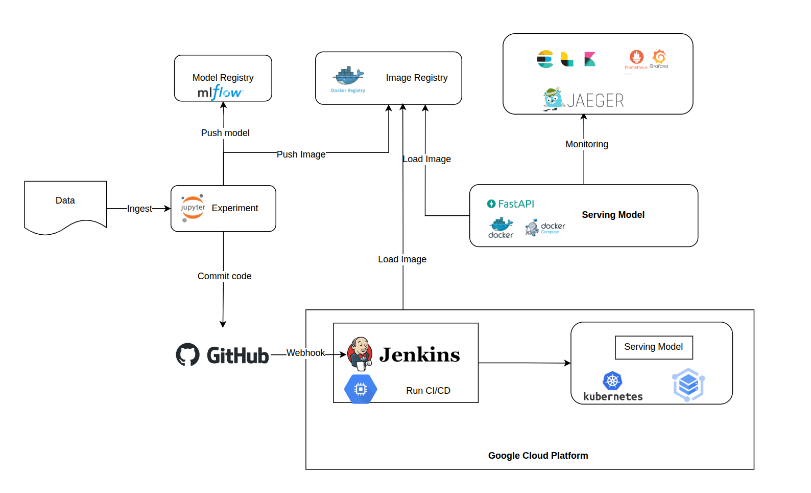
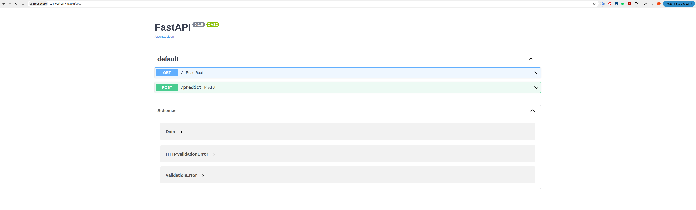
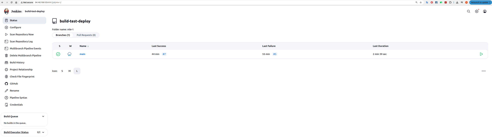

## Describe
This is  Project for learning MLOps. 
Techstack I used in this project:
-  **MLFlow**: Model registry, artifact store
-  **FastAPI**: model serving
-  **Prometheus,Cadvisor**: metrics collector
-  **Grafana**: metrics visualization
-  **Jaeger**: tracing
-  **ElasticSearch, Logstash, Kibana**: logs collector and analysis
-  **Docker,Docker-compose**: containerization
-  **Kubernetes,Helm**: container orchestration
-  **Jenkins**: CI/CD pipeline
-  **Github**: source version control
-  **Cloud service**: Google Kubernetes Engine
-  **Infrastructure as code**: Terraform, Ansible

## System Architecture

## Service 
### Cluster on GCP

### VM Instance on Cloud

### Serving Model Cloud

### Jenkin Cloud: 

